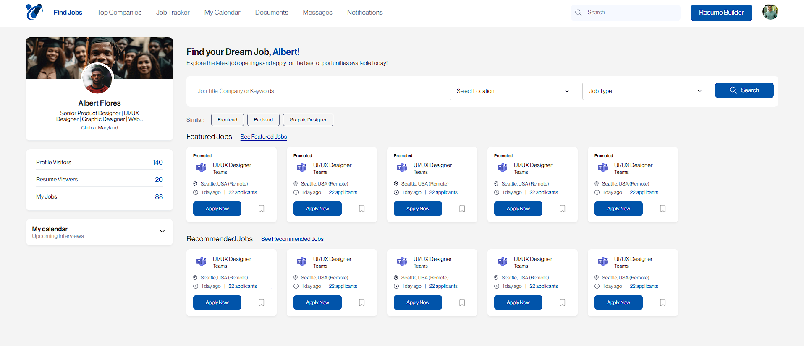

# TalentVare

A modern React application that helps users find and apply for jobs, track their applications, and manage their job search process efficiently.



## 🚀 Features

- **Note**: Only UI is Done. Not Functional
- **Job Search**: Search for jobs by title, company, or keyword
- **Location & Job Type Filtering**: Filter jobs by location and job type
- **Featured & Recommended Jobs**: View curated lists of jobs based on your profile


## 🛠️ Technologies Used

- React.js
- CSS3
- Font: Neue Haas Display
- React Icons

## 🔧 Installation & Setup

1. Clone the repository
   ```bash
   git clone https://github.com/muhammadadeel147/Talentvare
   cd Talentvare
   ```

2. Install dependencies
   ```bash
   npm install
   ```

3. Start the development server
   ```bash
   npm run dev
   ```

4. Open [http://localhost:5173/](http://localhost:5173/) to view it in your browser

## 📁 Project Structure

```
TALENTVARE/
├── public/
│   ├── index.html
│   └── favicon.ico
├── src/
│   ├── assets/
│   │   ├── fonts/
│   │   └── images/
│   ├── components/
│   │   ├── JobSearchDashboard/
│   ├── screenshot/
│   │   └── preview.PNG
│   ├── App.css
│   ├── App.js
│   └── index.js
├── package.json
└── README.md
```
## 📄 License

This project is licensed under the MIT License - see the LICENSE file for details.

## 👨‍💻 Contributors

- [Muhammad Adeel](https://github.com/muhammadadeel147)